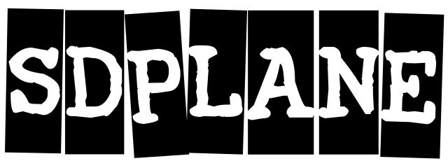

<div align="center">

</div>

# sdplane-oss (Soft Data Plane)

A "DPDK-dock Development Environment" consisting of an interactive shell that can control DPDK thread operations and a DPDK thread execution environment (sd-plane)

**Language:** **English** | [日本語](README.ja.md)

## Features

- **High-Performance Packet Processing**:
  Leverages DPDK for zero-copy, user-space packet processing
- **Layer 2/3 Forwarding**:
  Integrated L2 and L3 forwarding with ACL, LPM, and FIB support
- **Packet Generation**:
  Built-in packet generator for testing and benchmarking
- **Network Virtualization**:
  TAP interface support and VLAN switching capabilities
- **CLI Management**:
  Interactive command-line interface for configuration and monitoring
- **Multi-threading**:
  Cooperative threading model with per-core workers

### Architecture
- **Main Application**: Core router logic and initialization
- **DPDK Modules**: L2/L3 forwarding and packet generation
- **CLI System**: Command-line interface with completion and help
- **Threading**: lthread-based cooperative multitasking
- **Virtualization**: TAP interfaces and virtual switching

## Supported System

### Software Requirements
- **OS**:
  Ubuntu 24.04 LTS (currently supported)
- **NICs**:
  [Drivers](https://doc.dpdk.org/guides/nics/) | [Supported NICs](https://core.dpdk.org/supported/)
- **Memory**:
  Hugepage support required
- **CPU**:
  Multi-core processor recommended

### Target Hardware Platforms

The project has been tested on:
- **Topton (N305/N100)**: Mini-PC with 10G NICs (tested)
- **Partaker (J3160)**: Mini-PC with 1G NICs (tested)
- **Intel Generic PC**: With Intel x520 / Mellanox ConnectX5
- **Other CPUs**: Should work with AMD, ARM processors, etc.

## Getting Started

See [Getting Started](getting-started.en.md) for installation, configuration, and running instructions.

## Tips

See [Tips](tips.en.md) for configuration and operation hints.

## User's Guide (Manual)

Comprehensive user guides and command references are available:

- [User Guide](manual/en/README.md) - Complete overview and command classification

**Scenario Guides:**
- [L2 Repeater Application](manual/en/l2-repeater-application.md) - Simple Layer 2 packet forwarding with MAC learning
- [Enhanced Repeater Application](manual/en/enhanced-repeater-application.md) - VLAN-aware switching with TAP interfaces
- [Packet Generator Application](manual/en/packet-generator-application.md) - High-performance traffic generation and testing
- [Using a Switch](manual/ja/scenario-switch.md) - Configure VLAN-based L2 switching
- [Static Router Setup](manual/ja/scenario-static-router.md) - Configure an IP router with static routes

**Configuration Guides:**
- [Port Management & Statistics](manual/en/port-management.md) - DPDK port management and statistics
- [Worker & lcore Management & Thread Information](manual/en/worker-lcore-thread-management.md) - Worker threads, lcore, and thread information management
- [Debug & Logging](manual/en/debug-logging.md) - Debug and logging functions
- [VTY & Shell Management](manual/en/vty-shell.md) - VTY and shell management
- [System Information & Monitoring](manual/en/system-monitoring.md) - System information and monitoring
- [RIB & Routing](manual/en/routing.md) - RIB and routing functions
- [Queue Configuration](manual/en/queue-configuration.md) - Queue configuration and management
- [Packet Generation](manual/en/packet-generation.md) - Packet generation using PKTGEN
- [TAP Interface](manual/en/tap-interface.md) - TAP interface management
- [lthread Management](manual/en/lthread-management.md) - lthread management
- [Device Management](manual/en/device-management.md) - Device and driver management
- [Enhanced Repeater](manual/en/enhanced-repeater.md) - Virtual switching, VLAN processing, and TAP interfaces

**Command List:**
- [All Commands (Alphabetical)](manual/ja/command-list.md) - Index of all 112 commands

## Developer's Guide

### Integration Guide

- [DPDK Application Integration Guide](manual/en/dpdk-integration-guide.md) - How to integrate DPDK applications into sdplane using DPDK-dock approach

### Documentation

- [Technical Presentation/2024-11-22-sdn-onsen-yasu.pdf](https://enog.jp/wordpress/wp-content/uploads/2024/11/2024-11-22-sdn-onsen-yasu.pdf) (Japanese)
- [Technical Presentation/20250822_ENOG87_ohara.pdf](https://enog.jp/wordpress/wp-content/uploads/2025/08/20250822_ENOG87_ohara.pdf) (Japanese)

### Code Style
The project follows GNU coding standards. Use the provided scripts to check and format code:

```bash
# Check formatting
./style/check_gnu_style.sh check

# Show formatting differences
./style/check_gnu_style.sh diff

# Auto-format code
./style/check_gnu_style.sh update
```

## License

This project is licensed under the MIT License. See the [LICENSE](../LICENSE) file for license details.

## Contact

For questions, issues, or contributions, please contact: **sdplane [at] nwlab.org**

## Evaluation Equipment Purchase

Evaluation equipment with additional features and software modifications may be available. Please visit our sales page for more information:

**[https://www.rca.co.jp/sdplane/](https://www.rca.co.jp/sdplane/)**

*Note: The sales page is currently available in Japanese only.*

