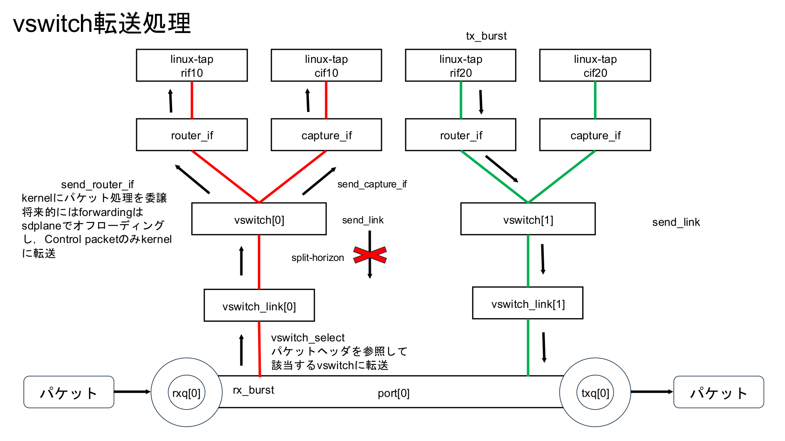
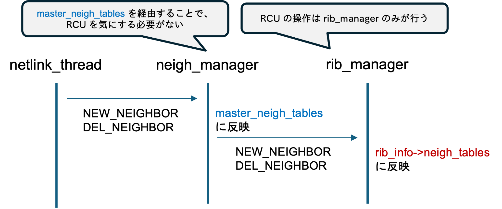
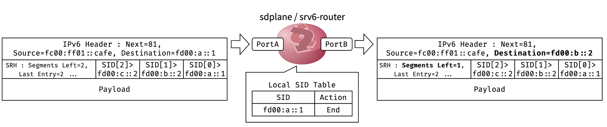

[トップ](../../../README.md) > [ユーザーガイド](README.md) > 管理・設定ガイド > RIB・ルーティング

# RIB・ルーティング

**Language:** [English](../en/routing.md) | **日本語**

RIB（Routing Information Base）とシステムリソース情報を管理するコマンドです。

### vswitch転送処理



### neighborのデータ構造




### SRv6転送機能



## コマンド一覧

- [`show_rib`](#show_rib) - RIB情報表示
- [`show_rib_route`](#show_rib_route) - ルーティングテーブル表示
- [`show_fib_route`](#show_fib_route) - FIBテーブル表示
- [`show_rib_nexthop_group`](#show_rib_nexthop_group) - ネクストホップグループ表示
- [`show_rib_nexthop_pool`](#show_rib_nexthop_pool) - ネクストホップ情報プール表示
- [`show_neighbor`](#show_neighbor) - ネイバーテーブル表示
- [`show_rib_vswitch`](#show_rib_vswitch) - 仮想スイッチ情報表示
- [`show_rib_vswitch_link`](#show_rib_vswitch_link) - 仮想スイッチリンク情報表示
- [`show_rib_router_if`](#show_rib_router_if) - ルーターインターフェース情報表示
- [`show_rib_capture_if`](#show_rib_capture_if) - キャプチャインターフェース情報表示
- [`set_vswitch`](#set_vswitch) - 仮想スイッチ作成
- [`set_vswitch_port`](#set_vswitch_port) - 仮想スイッチへポート追加
- [`set_vswitch_port_tag_swap`](#set_vswitch_port_tag_swap) - VLANタグ変換
- [`set_router_if`](#set_router_if) - ルーターインターフェース作成
- [`set_router_if_vlan`](#set_router_if_vlan) - ルーターインターフェースVLAN設定
- [`set_router_if_hwaddr`](#set_router_if_hwaddr) - ルーターインターフェースMACアドレス設定
- [`set_capture_if`](#set_capture_if) - キャプチャインターフェース作成
- [`no_set_vswitch`](#no_set_vswitch) - 仮想スイッチ削除
- [`no_set_vswitch_port`](#no_set_vswitch_port) - 仮想スイッチからポート削除
- [`no_set_router_if`](#no_set_router_if) - ルーターインターフェース削除
- [`no_set_capture_if`](#no_set_capture_if) - キャプチャインターフェース削除
- [`show_fdb`](#show_fdb) - FDB（転送データベース）表示
- [`set_netlink_hook`](#set_netlink_hook) - Netlinkフック設定
- [`show_netlink_hook`](#show_netlink_hook) - Netlinkフック表示
- [`set_srv6_local_sid`](#set_srv6_local_sid) - SRv6 Local SID設定
- [`show_srv6_local_sid`](#show_srv6_local_sid) - SRv6 Local SID表示

## コマンド一覧

### show_rib

RIB情報表示
```
show rib
```

RIB（Routing Information Base）の情報を表示します。

**使用例：**
```bash
show rib
```

このコマンドは以下の情報を表示します：
- RIBバージョンとメモリポインタ
- 仮想スイッチ構成とVLAN割り当て
- DPDKポート状態とキュー構成
- lcore-to-portキュー割り当て
- L2/L3転送用のネイバーテーブル

### show_rib_route

ルーティングテーブル表示
```
show rib (ipv4|ipv6) route
```

IPv4またはIPv6のルーティングテーブルを表示します。

**パラメータ：**
- `ipv4` - IPv4ルーティングテーブルを表示
- `ipv6` - IPv6ルーティングテーブルを表示

**使用例：**
```bash
show rib ipv4 route
show rib ipv6 route
```

### show_fib_route

FIBテーブル表示
```
show fib (ipv4|ipv6) route
```

IPv4またはIPv6のFIB（Forwarding Information Base）テーブルを表示します。FIBはRIBから選択された最適経路が格納される、実際の転送に使用されるテーブルです。

**パラメータ：**
- `ipv4` - IPv4 FIBテーブルを表示
- `ipv6` - IPv6 FIBテーブルを表示

**使用例：**
```bash
show fib ipv4 route
show fib ipv6 route
```

### show_rib_nexthop_group

ネクストホップグループ表示
```
show rib nexthop-group
```

ネクストホップグループのテーブルを表示します。`show rib nexthop-group` はグループの論理構造を示します。

**表示フィールド：**

| フィールド | 説明 |
|------------|------|
| ID | sdplane内部のネクストホップグループID |
| KernelID | Linuxカーネル側のnhid（分離型のみ表示） |
| RefCnt | このグループを参照しているルートエントリまたは他グループの数 |
| Nexthop Count | メンバーネクストホップの数 |
| Depends | このグループが参照している子グループのsdplane ID |
| Dependents | このグループを参照している親グループのsdplane ID |

**使用例：**
```bash
show rib nexthop-group
```

**出力例：**
```
ID: 13
KernelID: 10
RefCnt: 2
Nexthop Count: 1
Dependents: (15)
via 172.15.0.10, rif1 (14), IPv4, weight 0

ID: 15
KernelID: 100
RefCnt: 1
Nexthop Count: 2
Depends: (13) (14)
via 172.15.0.10, rif1 (14), IPv4, weight 1
via 172.16.0.10, rif2 (16), IPv4, weight 1
```

### show_rib_nexthop_pool

ネクストホップ情報プール表示
```
show rib nexthop-pool
```

ネクストホップ情報プールを表示します。`show rib nexthop-pool` は実際のネクストホップ情報（IPアドレス・インターフェース）を示します。

**表示フィールド：**

| フィールド | 説明 |
|------------|------|
| IDX | プール内のインデックス |
| RefCnt | このエントリを参照しているネクストホップグループメンバーの数 |
| Family | IPv4 / IPv6 |
| Type | gateway（GW経由）または connected（直接接続） |
| Gateway | ゲートウェイIPアドレス |
| Interface | 出力インターフェース名とインターフェース番号 |

**使用例：**
```bash
show rib nexthop-pool
```

**出力例：**
```
IDX    RefCnt  Family  Type     Gateway         Interface
--------------------------------------------------------------------------------
27     2       IPv4    gateway  172.15.0.10     rif1 (14)
29     2       IPv4    gateway  172.16.0.10     rif2 (16)
```

### show_neighbor

ネイバーテーブル表示
```
show neighbor (|ipv4|ipv6) (|<WORD>)
```

ネイバーテーブル（ARPテーブル / NDテーブル）を表示します。

**パラメータ：**
- `ipv4` - IPv4のARPテーブルを表示
- `ipv6` - IPv6のNDテーブルを表示
- `<WORD>` - 特定のインターフェース名でフィルタ
- パラメータなし - 全てのネイバーエントリを表示

**使用例：**
```bash
show neighbor
show neighbor ipv4
show neighbor ipv6
show neighbor ipv4 tap0
```

### show_rib_vswitch

仮想スイッチ情報表示
```
show rib vswitch
```

RIBに格納されている仮想スイッチの構成情報を表示します。`show vswitch` はこのコマンドのエイリアスです。

**使用例：**
```bash
show rib vswitch
show vswitch
```

### show_rib_vswitch_link

仮想スイッチリンク情報表示
```
show rib vswitch-link
```

仮想スイッチのポートリンク情報（ポートとVLANの関連付け）を表示します。

**使用例：**
```bash
show rib vswitch-link
```

### show_rib_router_if

ルーターインターフェース情報表示
```
show rib router-if
```

RIBに登録されているルーターインターフェース（TAPインターフェース）の情報を表示します。

**使用例：**
```bash
show rib router-if
```

### show_rib_capture_if

キャプチャインターフェース情報表示
```
show rib capture-if
```

RIBに登録されているキャプチャインターフェースの情報を表示します。

**使用例：**
```bash
show rib capture-if
```

## 設定コマンド

### set_vswitch

仮想スイッチ作成
```
set vswitch <1-4094> vlan <1-4094>
```

仮想スイッチを作成し、ネイティブVLAN IDを割り当てます。

**パラメータ：**
- `<1-4094>` (1番目) - 仮想スイッチID
- `<1-4094>` (2番目) - VLAN ID

**使用例：**
```bash
# VLAN 10 の仮想スイッチ 10 を作成
set vswitch 10 vlan 10

# VLAN 2031 の仮想スイッチ 2031 を作成
set vswitch 2031 vlan 2031
```

### set_vswitch_port

仮想スイッチへポート追加
```
set vswitch <1-4094> port <0-7> (tagged|untag)
```

DPDKポートを仮想スイッチに接続します。

**パラメータ：**
- `<1-4094>` - 仮想スイッチID
- `<0-7>` - DPDKポートID
- `tagged` - VLANタグ付きで接続（トランクポート）
- `untag` - VLANタグなしで接続（アクセスポート）

**使用例：**
```bash
# ポート0をアクセスポートとして接続
set vswitch 10 port 0 untag

# ポート0をトランクポートとして接続
set vswitch 2031 port 0 tagged
```

### set_vswitch_port_tag_swap

VLANタグ変換
```
set vswitch <1-4094> port <0-7> tag swap <1-4094>
```

ポート上でVLANタグの変換（スワップ）を行います。入力パケットのVLANタグを指定したVLAN IDに書き換えます。

**パラメータ：**
- `<1-4094>` (1番目) - 仮想スイッチID
- `<0-7>` - DPDKポートID
- `<1-4094>` (2番目) - 変換先のVLAN ID

**使用例：**
```bash
# ポート0のVLANタグをVLAN 100に変換
set vswitch 10 port 0 tag swap 100
```

### set_router_if

ルーターインターフェース作成
```
set vswitch <1-4094> router-if <WORD>
```

仮想スイッチにルーターインターフェース（TAPインターフェース）を作成します。L3ルーティングのゲートウェイとして機能します。

**パラメータ：**
- `<1-4094>` - 仮想スイッチID
- `<WORD>` - TAPインターフェース名

**使用例：**
```bash
# 仮想スイッチ 1 にルーターインターフェース rif1 を作成
set vswitch 1 router-if rif1
```

作成されたTAPインターフェースはLinux上に表示され、`ip addr add` でIPアドレスを付与できます。

### set_router_if_vlan

ルーターインターフェースVLAN設定
```
set vswitch <1-4094> router-if <WORD> vlan-id <0-4094>
```

ルーターインターフェースにVLAN IDを指定します。

**パラメータ：**
- `<1-4094>` - 仮想スイッチID
- `<WORD>` - TAPインターフェース名
- `<0-4094>` - VLAN ID

**使用例：**
```bash
set vswitch 10 router-if rif10 vlan-id 10
```

### set_router_if_hwaddr

ルーターインターフェースMACアドレス設定
```
set vswitch <1-4094> router-if <WORD> hwaddr <WORD>
```

ルーターインターフェースのMACアドレスを指定します。

**パラメータ：**
- `<1-4094>` - 仮想スイッチID
- `<WORD>` (1番目) - TAPインターフェース名
- `<WORD>` (2番目) - MACアドレス（例: `a8:b8:e0:05:9b:e1`）

**使用例：**
```bash
set vswitch 10 router-if rif10 hwaddr a8:b8:e0:05:9b:e1
```

### set_capture_if

キャプチャインターフェース作成
```
set vswitch <1-4094> capture-if <WORD>
```

仮想スイッチにキャプチャインターフェース（TAPインターフェース）を作成します。パケットキャプチャやモニタリングに使用します。

**パラメータ：**
- `<1-4094>` - 仮想スイッチID
- `<WORD>` - TAPインターフェース名

**使用例：**
```bash
# 仮想スイッチ 1 にキャプチャインターフェース cif1 を作成
set vswitch 1 capture-if cif1
```

### no_set_vswitch

仮想スイッチ削除
```
no set vswitch <1-4094>
```

仮想スイッチを削除します。

**パラメータ：**
- `<1-4094>` - 仮想スイッチID

**使用例：**
```bash
no set vswitch 10
```

### no_set_vswitch_port

仮想スイッチからポート削除
```
no set vswitch <1-4094> port <0-7>
```

仮想スイッチからポートを削除します。

**パラメータ：**
- `<1-4094>` - 仮想スイッチID
- `<0-7>` - DPDKポートID

**使用例：**
```bash
no set vswitch 10 port 0
```

### no_set_router_if

ルーターインターフェース削除
```
no set router-if <WORD>
```

ルーターインターフェースを削除します。

**パラメータ：**
- `<WORD>` - TAPインターフェース名

**使用例：**
```bash
no set router-if rif1
```

### no_set_capture_if

キャプチャインターフェース削除
```
no set capture-if <WORD>
```

キャプチャインターフェースを削除します。

**パラメータ：**
- `<WORD>` - TAPインターフェース名

**使用例：**
```bash
no set capture-if cif1
```

### show_fdb

FDB（転送データベース）表示
```
show fdb
```

FDB（Forwarding Database）のエントリを表示します。FDBはMACアドレス学習によって構築されるL2転送テーブルです。

**表示項目：**
- MACアドレス（送信元）
- 出力ポートID
- VLAN ID
- エントリ状態（Active / None）
- 最終検出時刻（last_seen）

**使用例：**
```bash
show fdb
```

FDBは最大1024エントリを保持し、デフォルトのエージングタイムは7200秒（2時間）です。

### set_netlink_hook

Netlinkフック設定
```
set netlink-hook <0-3> (ipv4|ipv6) ifaddr (new|del) ifname <WORD> argv-list <0-7>
```

Linuxカーネルのネットワークイベント（IPアドレスの追加・削除）を監視し、イベント発生時にコマンドリストを実行するフックを設定します。

**パラメータ：**
- `<0-3>` - フックインデックス（最大4個）
- `ipv4|ipv6` - アドレスファミリ
- `new|del` - イベント種別（アドレス追加 / 削除）
- `<WORD>` - 監視対象のインターフェース名
- `<0-7>` - 実行するargv-listのインデックス

**使用例：**
```bash
# rif1 にIPv4アドレスが追加されたら argv-list 0 を実行
set netlink-hook 0 ipv4 ifaddr new ifname rif1 argv-list 0
```

### show_netlink_hook

Netlinkフック表示
```
show netlink-hook (|<0-3>)
```

設定されているNetlinkフックの情報を表示します。

**パラメータ：**
- `<0-3>` - 特定のフックインデックスを指定（省略時は全て表示）

**使用例：**
```bash
show netlink-hook
show netlink-hook 0
```

## 静的経路の設定

sdplaneは、Linuxカーネルに設定された経路をnetlink経由で取り込みます。iproute2やFRRoutingによって設定された静的経路を使用できます。

### iproute2による静的経路設定

sdplaneはRoute ObjectとNexthop Objectを分離しない**非分離型**（従来方式）と、`ip nexthop` コマンドで両者を分離する**分離型**をサポートします。Nexthop Groupによるマルチパスルートも使用できます。

#### 1) 非分離型（従来方式）

```bash
# シングルパス
ip route add 10.10.10.0/24 via 172.15.0.10 dev rif1

# マルチパス
ip route add 10.20.20.0/24 \
  nexthop via 172.15.0.10 dev rif1 \
  nexthop via 172.16.0.10 dev rif2
```

#### 2) 分離型（Route Object / Nexthop Object分離方式）

sdplaneはLinuxカーネルのnhidを内部IDへマッピングして管理します。

```bash
# シングルパス
ip nexthop add id 10 via 172.15.0.10 dev rif1
ip route add 10.30.30.0/24 nhid 10

# マルチパス（Nexthop Group）
ip nexthop add id 10 via 172.15.0.10 dev rif1
ip nexthop add id 11 via 172.16.0.10 dev rif2
ip nexthop add id 100 group 10/11
ip route add 10.40.40.0/24 nhid 100
```

#### 経路確認

以下は分離型でシングルパス・マルチパスを設定した場合の出力例です。

```
console> show rib ipv4 route
Destination      Nexthop                       Interface
[snip]
[2] 10.30.30.0/24    172.15.0.10    13    rif1 (14)
[3] 10.40.40.0/24    172.15.0.10    15    rif1 (14)
                      172.16.0.10          rif2 (16)
```

### FRRoutingによる静的経路設定

FRRの `vtysh` で静的経路を設定すると、staticd → zebra経由でカーネルへ投入され、sdplaneがnetlinkで取り込みます。

**動作確認済みバージョン:** FRR 10.5.2

```bash
vtysh
router# configure terminal

# シングルパス
router(config)# ip route 10.10.10.0/24 172.15.0.10

# マルチパス
router(config)# ip route 10.20.20.0/24 172.15.0.10
router(config)# ip route 10.20.20.0/24 172.16.0.10
```

#### 経路確認

```bash
# FRR側
router# show ip route static
router# show nexthop-group rib

# sdplane側
console> show rib ipv4 route
console> show rib nexthop-group
console> show rib nexthop-pool
```

## 動的経路制御（FRRouting / Bird連携）

sdplaneは制御パケット（ARP/ND/OSPFなど）をルーターインターフェース（TAPデバイス）に受け渡し、FRRoutingやBirdと連携して動的経路制御を行えます。

### 制御パケットの扱い

ルータ処理スレッド（`router` / `srv6-router`）は以下を制御パケットとして判定し、ルーターインターフェース（TAPデバイス）へ送出します：

- ARP
- IPv6 NS/NA（近傍探索/近傍広告）
- OSPF（IPv4/IPv6）
- 宛先が自ルーターインターフェースのIP/MACに一致するパケット

近傍解決情報（ARP/ND）は内部メッセージ経由でネイバーテーブルに反映されます。

## SRv6

sdplaneはSRv6（Segment Routing over IPv6）Transit Node動作を実装しています。

### 対応機能

- SRH type 4（`RTE_IPV6_SRCRT_TYPE_4`）を処理
- End相当の基本動作（segments_leftデクリメント + 次SIDをIPv6宛先へ反映）
- local-sidは最大16個（0〜15）設定可能
- `srv6-router` ワーカータイプで使用

### SRv6コマンド

#### set_srv6_local_sid

SRv6 Local SIDの設定
```
set srv6 local-sid <WORD> (|<0-15>)
```

SRv6のLocal SIDを設定します。

**パラメータ：**
- `<WORD>` - IPv6アドレス（SID）
- `<0-15>` - Local SIDインデックス（省略時は0）

**使用例：**
```bash
set srv6 local-sid 2001:db8::1
set srv6 local-sid 2001:db8::2 1
```

#### show_srv6_local_sid

SRv6 Local SIDの表示
```
show srv6 local-sid
```

設定されているSRv6 Local SIDを表示します。

**使用例：**
```bash
show srv6 local-sid
```

## RIBの概要

### RIBとは
RIB（Routing Information Base）は、システムリソースとネットワーク情報を格納する中央データベースです。sdplaneでは、以下の情報を管理しています：

- **仮想スイッチ構成** - VLANスイッチングとポート割り当て
- **DPDKポート情報** - リンク状態、キュー構成、機能情報
- **lcoreキュー構成** - CPUコアごとのパケット処理割り当て
- **ネイバーテーブル** - L2/L3転送データベースエントリ

### RIBの構造
RIBは2つの主要な構造体で構成されています：

```c
struct rib {
    struct rib_info *rib_info;  // 実際のデータへのポインタ
};

struct rib_info {
    uint32_t ver;                                    // バージョン番号
    uint8_t vswitch_size;                           // 仮想スイッチ数
    uint8_t port_size;                              // DPDKポート数
    uint8_t lcore_size;                             // lcore数
    struct vswitch_conf vswitch[MAX_VSWITCH];       // 仮想スイッチ構成
    struct vswitch_link vswitch_link[MAX_VSWITCH_LINK]; // VLANポートリンク
    struct port_conf port[MAX_ETH_PORTS];           // DPDKポート構成
    struct lcore_qconf lcore_qconf[RTE_MAX_LCORE];  // lcoreキュー割り当て
    struct neigh_table neigh_tables[NEIGH_NR_TABLES]; // ネイバー/転送テーブル
};
```

## RIB情報の見方

### 基本的な表示項目
- **Destination** - 宛先ネットワークアドレス
- **Netmask** - ネットマスク
- **Gateway** - ゲートウェイ（ネクストホップ）
- **Interface** - 出力インターフェース
- **Metric** - ルートのメトリック値
- **Status** - ルートの状態

### ルートの状態
- **Active** - アクティブなルート
- **Inactive** - 非アクティブなルート
- **Pending** - 設定中のルート
- **Invalid** - 無効なルート

## 使用例

### 基本的な使用方法
```bash
# RIB情報の表示
show rib
```

### 出力例の解釈
```
rib information version: 21 (0x55555dd42010)
vswitches: 
dpdk ports: 
  dpdk_port[0]: 
    link: speed=1000Mbps duplex=full autoneg=on status=up
    nb_rxd=1024 nb_txd=1024
    queues: nrxq=1 ntxq=4
  dpdk_port[1]: 
    link: speed=0Mbps duplex=half autoneg=on status=down
    nb_rxd=1024 nb_txd=1024
    queues: nrxq=1 ntxq=4
  dpdk_port[2]: 
    link: speed=0Mbps duplex=half autoneg=off status=down
    nb_rxd=1024 nb_txd=1024
    queues: nrxq=1 ntxq=4
lcores: 
  lcore[0]: nrxq=0
  lcore[1]: nrxq=1
    rxq[0]: dpdk_port[0], queue_id=0
  lcore[2]: nrxq=1
    rxq[0]: dpdk_port[1], queue_id=0
  lcore[3]: nrxq=1
    rxq[0]: dpdk_port[2], queue_id=0
  lcore[4]: nrxq=0
  lcore[5]: nrxq=0
  lcore[6]: nrxq=0
  lcore[7]: nrxq=0
```

この例では：
- RIBバージョン21が現在のシステム状態を示す
- DPDKポート0がアクティブ（up）で1Gbpsリンク速度
- DPDKポート1、2は非アクティブ（down）でリンクなし
- lcore 1、2、3がそれぞれポート0、1、2からのパケット処理を担当
- 各ポートは1個のRXキューと4個のTXキューを使用
- RX/TXディスクリプタリングは1024エントリで設定

## RIBの管理

### 自動更新
RIBは以下のタイミングで自動的に更新されます：
- インターフェースの状態変更
- ネットワーク設定の変更
- ルーティングプロトコルからの情報受信

### 手動更新
RIB情報を手動で確認するには：
```bash
show rib
```

## トラブルシューティング

### ルーティングが正しく動作しない場合
1. RIB情報を確認
```bash
show rib
```

2. インターフェース状態を確認
```bash
show port
```

3. ワーカーの状態を確認
```bash
show worker
```

### RIBにルートが表示されない場合
- ネットワーク設定を確認
- インターフェースの状態を確認
- RIBマネージャーの動作を確認

## 高度な機能

### RIBマネージャー
RIBマネージャーは独立したスレッドとして動作し、以下の機能を提供します：
- ルーティング情報の自動更新
- ルートの有効性チェック
- ネットワーク状態の監視

### 関連するワーカー
- **rib-manager** - RIBの管理を行うワーカー
- **neigh-manager** - ARP/NDテーブルの管理
- **netlink-thread** - Linuxカーネルとのnetlink通信（経路・アドレス同期）
- **router** - vswitchベースのL3ルーター
- **srv6-router** - SRv6ルーター
- **l3-tap-handler** - ルーターインターフェース経由のパケット処理

## 定義場所

このコマンドは以下のファイルで定義されています：
- `sdplane/rib.c` - RIB、仮想スイッチ、FDB、ネイバーテーブル関連コマンド
- `sdplane/netlink_hook.c` - Netlinkフック関連コマンド

## 関連項目

- [スイッチを使う](scenario-switch.md) - L2スイッチングのシナリオガイド
- [ルータを設定する：静的経路のみ](scenario-static-router.md) - 静的経路ルータのシナリオガイド
- [ワーカー・lcore管理](worker-lcore-thread-management.md)
- [lthread管理](lthread-management.md)
- [システム情報・監視](system-monitoring.md)