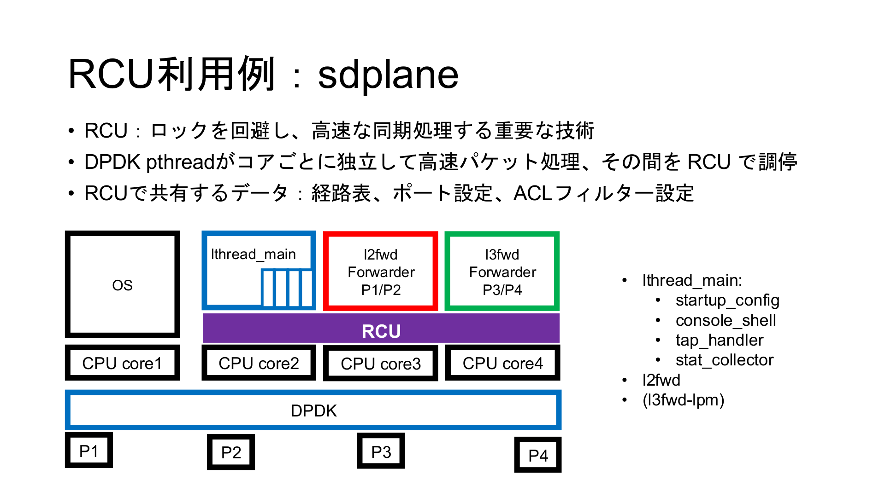
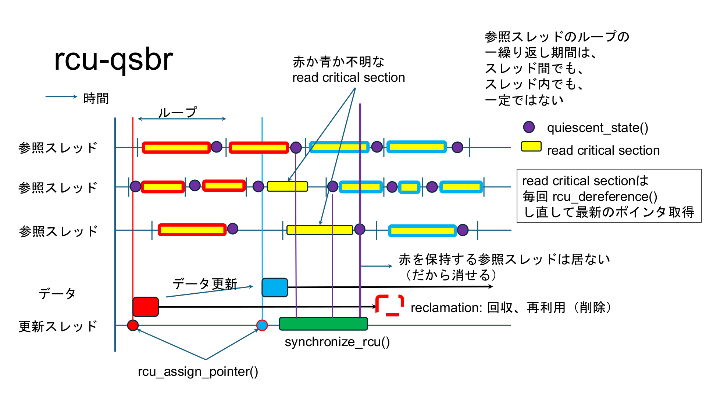
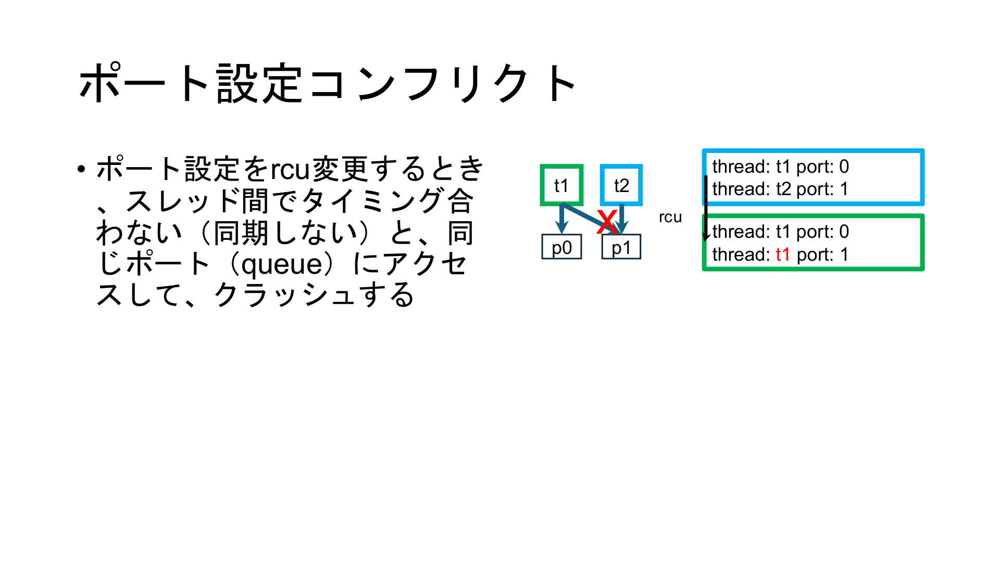
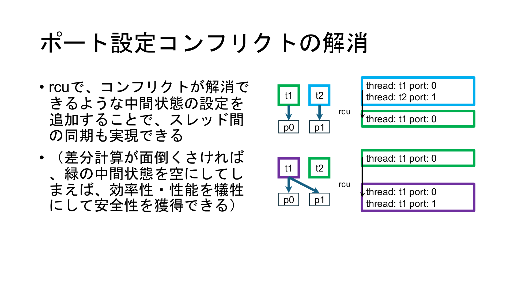

[トップ](../../../README.md) > [ユーザーガイド](README.md) > 管理・設定ガイド > システム情報・監視

# システム情報・監視

**Language:** [English](../en/system-monitoring.md) | **日本語**

sdplaneのシステム情報と監視機能を提供するコマンドです。

## コマンド一覧

- [`show_version`](#show_version) - バージョン表示
- [`set_locale`](#set_locale) - ロケール設定
- [`set_argv_list_1`](#set_argv_list_1) - argv-list設定
- [`show argv-list`](#show-argv-list)
- [`show argv-list \<0-7\>`](#show-argv-list-0-7)
- [`show_rcu`](#show_rcu) - RCU情報表示
- [`show_fdb`](#show_fdb) - FDB情報表示
- [`show_vswitch`](#show_vswitch) - vswitch情報表示
- [`sleep_cmd`](#sleep_cmd) - スリープコマンド
- [`show_mempool`](#show_mempool) - メモリプール情報表示

## コマンド一覧

### show_version

バージョン表示
```
show version
```

sdplaneのバージョン情報を表示します。

**使用例：**
```bash
show version
```

### set_locale

ロケール設定
```
set locale (C|C.utf8|en_US.utf8|POSIX)
```

システムのロケールを設定します。

**利用可能なロケール：**
- `C` - 標準Cロケール
- `C.utf8` - UTF-8対応Cロケール
- `en_US.utf8` - 英語UTF-8ロケール
- `POSIX` - POSIXロケール

**使用例：**
```bash
# UTF-8対応Cロケールに設定
set locale C.utf8

# 英語UTF-8ロケールに設定
set locale en_US.utf8
```

### set_argv_list_1

argv-list設定
```
set argv-list <0-7> <WORD>
```

コマンドライン引数リストを設定します。

**パラメータ：**
- `<0-7>` - インデックス（0-7）
- `<WORD>` - 設定する文字列

**使用例：**
```bash
# インデックス0に引数を設定
set argv-list 0 "--verbose"

# インデックス1に引数を設定
set argv-list 1 "--config"
```

### **show argv-list**

設定された全てのコマンドライン引数リストを表示します。

**使用例：**
```bash
# 全てのargv-listを表示
show argv-list
```

---

### **show argv-list \<0-7\>**

特定のインデックスのargv-listを表示します。

**使用例：**
```bash
# 特定のインデックスのargv-listを表示
show argv-list 0

# argv-listインデックス3を表示
show argv-list 3
```

### show_rcu

RCU情報表示
```
show rcu
```

RCU（Read-Copy-Update）の情報を表示します。

**使用例：**
```bash
show rcu
```

### show_fdb

FDB情報表示
```
show fdb
```

FDB（Forwarding Database）の情報を表示します。

**使用例：**
```bash
show fdb
```

### show_vswitch

vswitch情報表示
```
show vswitch
```

仮想スイッチの情報を表示します。

**使用例：**
```bash
show vswitch
```

### sleep_cmd

スリープコマンド
```
sleep <0-300>
```

指定された秒数だけスリープします。

**パラメータ：**
- `<0-300>` - スリープ時間（秒）

**使用例：**
```bash
# 5秒間スリープ
sleep 5

# 30秒間スリープ
sleep 30
```

### show_mempool

メモリプール情報表示
```
show mempool
```

DPDKメモリプールの情報を表示します。

**使用例：**
```bash
show mempool
```

## 監視項目の説明

### バージョン情報
- sdplaneのバージョン
- ビルド情報
- 依存ライブラリのバージョン

### RCU情報





- Read-Copy-Update機構の状態
- 同期処理の状況
- メモリ管理の状態

#### ポート設定コンフリクトとRCUによる解消





### FDB情報
- MACアドレステーブルの状態
- 学習済みMACアドレス
- エージアウト情報

### vswitch情報
- 仮想スイッチの設定
- ポート情報
- VLAN設定

### メモリプール情報
- 利用可能メモリ
- 使用中メモリ
- メモリプールの統計

## 監視のベストプラクティス

### 定期監視
```bash
# 基本的な監視コマンド
show version
show mempool
show vswitch
show rcu
```

### パフォーマンス監視
```bash
# スレッドカウンターによるパフォーマンス監視
show thread counter
```

### トラブルシューティング
```bash
# システム状態の確認
show fdb
show vswitch
show mempool
```

## 定義場所

これらのコマンドは以下のファイルで定義されています：
- `sdplane/sdplane.c`

## 関連項目

- [ポート管理・統計](port-management.md)
- [ワーカー・lcore管理](worker-lcore-thread-management.md)
- [スレッド情報](worker-lcore-thread-management.md)