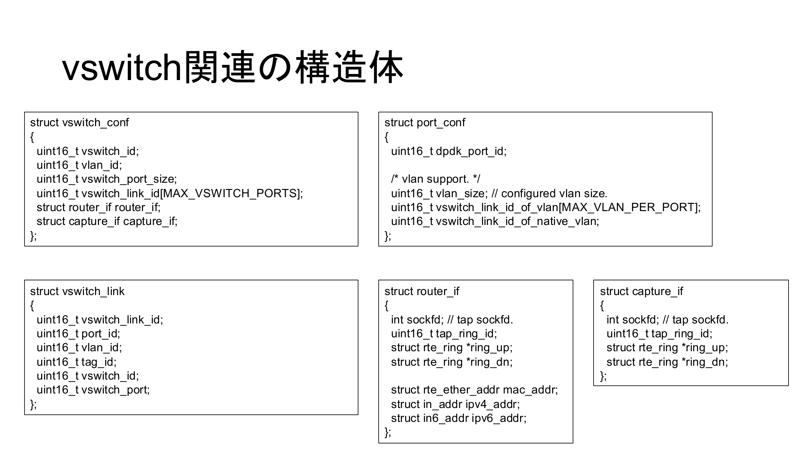
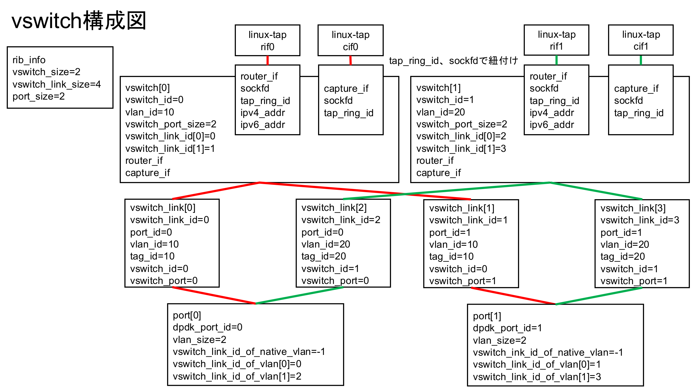
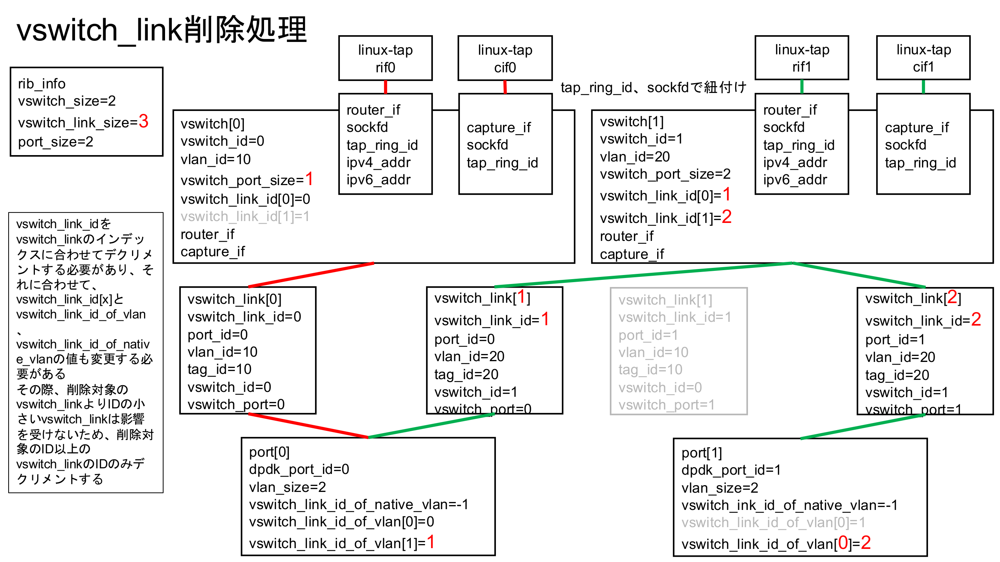
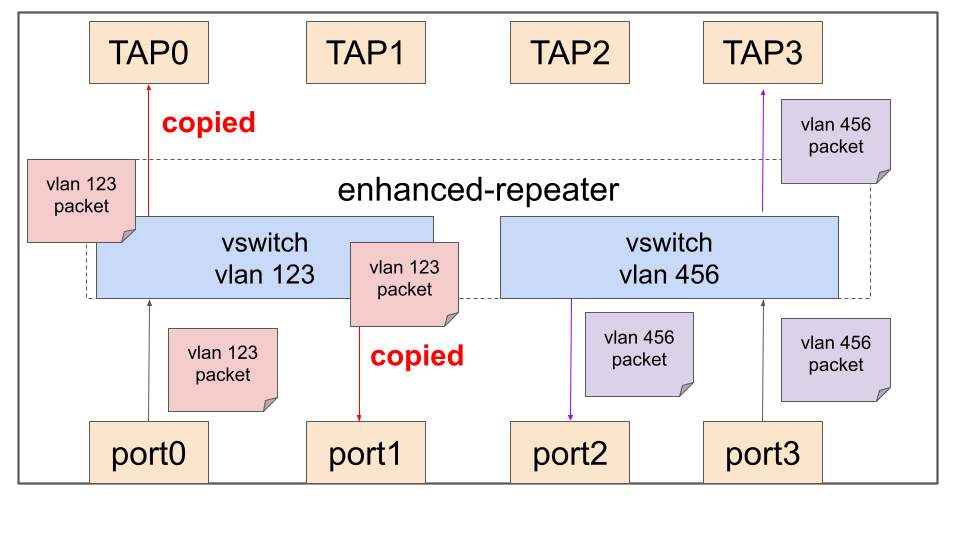

[トップ](../../../README.md) > [ユーザーガイド](README.md) > 管理・設定ガイド > 仮想スイッチ（vswitch）

# 仮想スイッチ（vswitch）

**Language:** [English](../en/vswitch.md) | **日本語**

仮想スイッチ（vswitch）は、DPDKポート間でVLANベースのL2スイッチングを行うための機能です。複数のVLANドメインを独立した転送テーブルで管理し、ルーターインターフェースやキャプチャインターフェースを通じてLinuxカーネルスタックと統合できます。

## vswitch関連の構造体



## vswitch構成図



## vswitch_link削除処理



## vswitch転送処理


## 拡張リピーター構成図



## コマンド一覧

### 表示コマンド

- [`show_rib_vswitch`](#show_rib_vswitch) - 仮想スイッチ情報表示
- [`show_rib_vswitch_link`](#show_rib_vswitch_link) - 仮想スイッチリンク情報表示
- [`show_rib_router_if`](#show_rib_router_if) - ルーターインターフェース情報表示
- [`show_rib_capture_if`](#show_rib_capture_if) - キャプチャインターフェース情報表示

### 設定コマンド

- [`set_vswitch`](#set_vswitch) - 仮想スイッチ作成
- [`set_vswitch_port`](#set_vswitch_port) - 仮想スイッチへポート追加
- [`set_vswitch_port_tag_swap`](#set_vswitch_port_tag_swap) - VLANタグ変換
- [`set_router_if`](#set_router_if) - ルーターインターフェース作成
- [`set_router_if_vlan`](#set_router_if_vlan) - ルーターインターフェースVLAN設定
- [`set_router_if_hwaddr`](#set_router_if_hwaddr) - ルーターインターフェースMACアドレス設定
- [`set_capture_if`](#set_capture_if) - キャプチャインターフェース作成

### 削除コマンド

- [`no_set_vswitch`](#no_set_vswitch) - 仮想スイッチ削除
- [`no_set_vswitch_port`](#no_set_vswitch_port) - 仮想スイッチからポート削除
- [`no_set_router_if`](#no_set_router_if) - ルーターインターフェース削除
- [`no_set_capture_if`](#no_set_capture_if) - キャプチャインターフェース削除

## 表示コマンド

### show_rib_vswitch

仮想スイッチ情報表示
```
show rib vswitch
```

RIBに格納されている仮想スイッチの構成情報を表示します。`show vswitch` はこのコマンドのエイリアスです。

**使用例：**
```bash
show rib vswitch
show vswitch
```

### show_rib_vswitch_link

仮想スイッチリンク情報表示
```
show rib vswitch-link
```

仮想スイッチのポートリンク情報（ポートとVLANの関連付け）を表示します。

**使用例：**
```bash
show rib vswitch-link
```

### show_rib_router_if

ルーターインターフェース情報表示
```
show rib router-if
```

RIBに登録されているルーターインターフェース（TAPインターフェース）の情報を表示します。

**使用例：**
```bash
show rib router-if
```

### show_rib_capture_if

キャプチャインターフェース情報表示
```
show rib capture-if
```

RIBに登録されているキャプチャインターフェースの情報を表示します。

**使用例：**
```bash
show rib capture-if
```

## 設定コマンド

### set_vswitch

仮想スイッチ作成
```
set vswitch <1-4094> vlan <1-4094>
```

仮想スイッチを作成し、ネイティブVLAN IDを割り当てます。

**パラメータ：**
- `<1-4094>` (1番目) - 仮想スイッチID
- `<1-4094>` (2番目) - VLAN ID

**使用例：**
```bash
# VLAN 10 の仮想スイッチ 10 を作成
set vswitch 10 vlan 10

# VLAN 2031 の仮想スイッチ 2031 を作成
set vswitch 2031 vlan 2031
```

### set_vswitch_port

仮想スイッチへポート追加
```
set vswitch <1-4094> port <0-7> (tagged|untag)
```

DPDKポートを仮想スイッチに接続します。

**パラメータ：**
- `<1-4094>` - 仮想スイッチID
- `<0-7>` - DPDKポートID
- `tagged` - VLANタグ付きで接続（トランクポート）
- `untag` - VLANタグなしで接続（アクセスポート）

**使用例：**
```bash
# ポート0をアクセスポートとして接続
set vswitch 10 port 0 untag

# ポート0をトランクポートとして接続
set vswitch 2031 port 0 tagged
```

### set_vswitch_port_tag_swap

VLANタグ変換
```
set vswitch <1-4094> port <0-7> tag swap <1-4094>
```

ポート上でVLANタグの変換（スワップ）を行います。入力パケットのVLANタグを指定したVLAN IDに書き換えます。

**パラメータ：**
- `<1-4094>` (1番目) - 仮想スイッチID
- `<0-7>` - DPDKポートID
- `<1-4094>` (2番目) - 変換先のVLAN ID

**使用例：**
```bash
# ポート0のVLANタグをVLAN 100に変換
set vswitch 10 port 0 tag swap 100
```

### set_router_if

ルーターインターフェース作成
```
set vswitch <1-4094> router-if <WORD>
```

仮想スイッチにルーターインターフェース（TAPインターフェース）を作成します。L3ルーティングのゲートウェイとして機能します。

**パラメータ：**
- `<1-4094>` - 仮想スイッチID
- `<WORD>` - TAPインターフェース名

**使用例：**
```bash
# 仮想スイッチ 1 にルーターインターフェース rif1 を作成
set vswitch 1 router-if rif1
```

作成されたTAPインターフェースはLinux上に表示され、`ip addr add` でIPアドレスを付与できます。

### set_router_if_vlan

ルーターインターフェースVLAN設定
```
set vswitch <1-4094> router-if <WORD> vlan-id <0-4094>
```

ルーターインターフェースにVLAN IDを指定します。

**パラメータ：**
- `<1-4094>` - 仮想スイッチID
- `<WORD>` - TAPインターフェース名
- `<0-4094>` - VLAN ID

**使用例：**
```bash
set vswitch 10 router-if rif10 vlan-id 10
```

### set_router_if_hwaddr

ルーターインターフェースMACアドレス設定
```
set vswitch <1-4094> router-if <WORD> hwaddr <WORD>
```

ルーターインターフェースのMACアドレスを指定します。

**パラメータ：**
- `<1-4094>` - 仮想スイッチID
- `<WORD>` (1番目) - TAPインターフェース名
- `<WORD>` (2番目) - MACアドレス（例: `a8:b8:e0:05:9b:e1`）

**使用例：**
```bash
set vswitch 10 router-if rif10 hwaddr a8:b8:e0:05:9b:e1
```

### set_capture_if

キャプチャインターフェース作成
```
set vswitch <1-4094> capture-if <WORD>
```

仮想スイッチにキャプチャインターフェース（TAPインターフェース）を作成します。パケットキャプチャやモニタリングに使用します。

**パラメータ：**
- `<1-4094>` - 仮想スイッチID
- `<WORD>` - TAPインターフェース名

**使用例：**
```bash
# 仮想スイッチ 1 にキャプチャインターフェース cif1 を作成
set vswitch 1 capture-if cif1
```

## 削除コマンド

### no_set_vswitch

仮想スイッチ削除
```
no set vswitch <1-4094>
```

仮想スイッチを削除します。

**パラメータ：**
- `<1-4094>` - 仮想スイッチID

**使用例：**
```bash
no set vswitch 10
```

### no_set_vswitch_port

仮想スイッチからポート削除
```
no set vswitch <1-4094> port <0-7>
```

仮想スイッチからポートを削除します。

**パラメータ：**
- `<1-4094>` - 仮想スイッチID
- `<0-7>` - DPDKポートID

**使用例：**
```bash
no set vswitch 10 port 0
```

### no_set_router_if

ルーターインターフェース削除
```
no set router-if <WORD>
```

ルーターインターフェースを削除します。

**パラメータ：**
- `<WORD>` - TAPインターフェース名

**使用例：**
```bash
no set router-if rif1
```

### no_set_capture_if

キャプチャインターフェース削除
```
no set capture-if <WORD>
```

キャプチャインターフェースを削除します。

**パラメータ：**
- `<WORD>` - TAPインターフェース名

**使用例：**
```bash
no set capture-if cif1
```

## アーキテクチャ

### 仮想スイッチフレームワーク

仮想スイッチは以下の機能を提供します：

- **複数VLAN**: 複数のVLANドメイン（1-4094）のサポート
- **ポート集約**: 仮想スイッチあたり複数の物理ポート
- **分離転送**: VLANごとの独立した転送ドメイン
- **柔軟なタギング**: ポートごとのネイティブ、タグ付き、変換モード

### TAPインターフェース統合

- **ルーターインターフェース**: L3処理のためのカーネルネットワークスタック統合
- **キャプチャインターフェース**: パケット監視と解析機能
- **リングバッファ**: データプレーンとカーネル間の効率的なパケット転送
- **双方向**: 入出力両方向のパケット処理

### VLAN処理

- **VLANタギング**: アンタグフレームへの802.1Qヘッダーの追加
- **VLANアンタギング**: タグ付きフレームからの802.1Qヘッダーの除去
- **VLAN変換**: 入出力間でのVLAN IDの変更
- **ネイティブVLAN**: トランクポートでのアンタグトラフィックの処理

### パケットフロー

1. **入力処理**: DPDKポートでのパケット受信 → タグまたはネイティブ設定に基づくVLAN判定 → 宛先仮想スイッチの検索
2. **仮想スイッチ検索**: MACアドレス学習と検索 → VLANドメイン内での出力ポート決定 → 未知のユニキャスト/ブロードキャストフラッディングの処理
3. **出力処理**: ポート設定ごとのVLANヘッダー操作 → 複数宛先のパケットコピー → TAPインターフェース統合
4. **TAPインターフェース処理**: ルーターインターフェース（カーネルL3処理）/ キャプチャインターフェース（監視と解析）

## 設定例

### 基本的なVLANスイッチング

```bash
# 仮想スイッチを作成
set vswitch 2031 vlan 2031
set vswitch 2032 vlan 2032

# DPDKポートを仮想スイッチに接続
set vswitch 2031 port 0 tagged
set vswitch 2032 port 0 tagged

# ルーターインターフェースを作成
set vswitch 2031 router-if rif2031
set vswitch 2032 router-if rif2032

# キャプチャインターフェースを作成
set vswitch 2031 capture-if cif2031
set vswitch 2032 capture-if cif2032
```

### 動作確認

```bash
# 仮想スイッチ設定の確認
show vswitch
show rib vswitch-link
show rib router-if
show rib capture-if
```

## 定義場所

これらのコマンドは以下のファイルで定義されています：
- `sdplane/rib.c` - 仮想スイッチ関連コマンド

## 関連項目

- [RIB・ルーティング](routing.md) - RIBとルーティング機能
- [FDB（転送データベース）](fdb.md) - MACアドレス学習テーブル
- [ネイバーテーブル](neighbor.md) - ARP/NDテーブルの管理
- [スイッチを使う](scenario-switch.md) - L2スイッチングのシナリオガイド
- [ルータを設定する：静的経路のみ](scenario-static-router.md) - 静的経路ルータのシナリオガイド
- [拡張リピーターアプリケーション](enhanced-repeater-application.md) - 拡張リピーター機能の詳細
